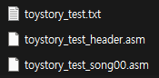
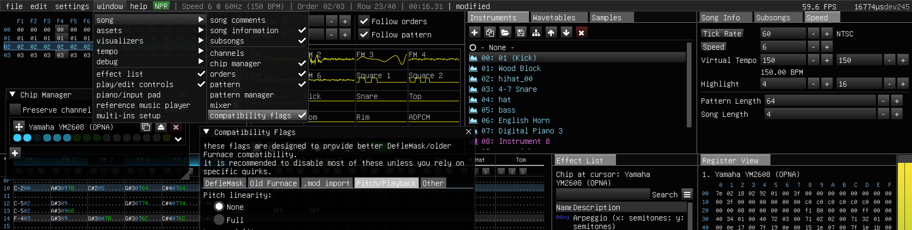

# MAIN UPDATES PAUSED UNTIL FURNACE FIXES TEXT EXPORT ISSUE

# furEPSM

A ***WIP*** lightweight NES [EPSM](https://www.nesdev.org/wiki/Expansion_Port_Sound_Module) music driver for [Furnace](https://github.com/tildearrow/furnace)

Gone are the days you had to learn [FamiStudio](https://famistudio.org/) just to put EPSM tracks into your game. Waited a long time, tracker users.

## Resource usage

- CPU cycles: Approx. 2190 cycles
- RAM usage: 143 bytes (+ 5 bytes on zero-page)
- ROM usage: 2424 bytes

## Supported effects

- `08xy` - Set panning
- `80xx` - Set panning
- `0Bxx` - Jump to frame xx
- `0D00` - Next frame
- `0Fxx` - Set speed
- `E5xx` - Set pitch offset (pseudo implementation)
- `ECxx` - Delayed note cut (priority has inaccuracy)
- `EDxx` - Note delay (only one at once)
- `FDxx` - Set tempo
- `FFxx` - Stop song

## TODO

- Implement effects in SSG
- Add rhythm kit support
- Add noise support for SSG
- Add pitch bend effects (portamento, vibrato)

## Major missing features

- Effects in SSG channels
- Grooves
- Pitch related effects
- SSG macros except for volume
- SSG macro release
- Rhythm kit support

## Non-goals (lowest priority)

- Grooves
- Arpeggio effect
- FM macros
- SSG PCM streaming
- 2A03 APU hijack

## Usage

The [bytecode converter](converter/furnace2asm.py) accepts [YM2608](https://github.com/tildearrow/furnace/blob/master/doc/7-systems/ym2608.md) (no CSM or exp 3CH) Furnace text export and generates one header file and track sequence data for each subsongs.



Make sure to use "one speed" + "Virtual Tempo" scheme for "Speed" instead of "groove pattern" or "two (alternating) speeds" mode.

And the "Pitch linearity" in "Compatibility Flags" should be "None".



The driver is particularly intended to use with bankswitched songs. You should write your own bankswitching logic. (a music driver will have no idea how your bankswitching system works) Just the update routine has to be called with the correct bank set right before.

### Including in your game

The driver is written to use with [ASM6f NES/Famicom 6502 assembler](https://github.com/freem/asm6f).

The three major files you should include are-

- The music driver
- Generated module header file from the bytecode converter, which includes shared data such as instrument data, subsong pointers
- Generated subsong sequence file(s) for each songs, from the bytecode converter

Include the music driver `.asm` source using `.include` directive. The header file should also be included in the *same* bank as the music driver, but it doesn't matter as long as the header is *always* loaded in memory map when the music driver stuff is happening.

```x86asm
.base $8000
		.include "furEPSM.asm"
		.include "song_header.asm"
.pad $A000,$FF
```

In very first lines of `furEPSM.asm`, you can locate where furEPSM RAM variables live, and disable some features to save CPU cost and RAM usage.

```x86asm
; =========================================================================================
;
; **USER SETTINGS**
;
; =========================================================================================

furEPSM_zp = $FB ; 5 bytes zero page variable
furEPSM_bss = $300 ; < 256 bytes of main variables

furEPSM_TEMPOCONSTANT = 3600 ; 3600 = NTSC, 3000 = PAL

furEPSM_ENABLE_SSG = 1
furEPSM_ENABLE_DELAYEDROW = 1

...
```

The song data can be added with the same way as the music driver. Find an empty bank for the track data, and just `.include` them.

You don't have to label them here. The labels are already defined in each files already.

```x86asm
.base $A000
		; No labels required
		.include "song_song00.asm"
.pad $C000,$FF
```

### Playing a song

Playing a song is as easy as choosing song with your MP3 player. Load subsong number **starting from zero** in `A` register and call `furEPSM_play`.

**THE SONG BANK** should be set before calling `furEPSM_play` and `furEPSM_update`. Otherwise the driver will read wrong data from other unrelated banks.

```x86asm
		LDA #SONG_BANK
		STA MAPPER_PRG
		LDA #SONG_TITLE
		JSR furEPSM_play
```

Call `furEPSM_update` in every frames to update sequence constantly, normally it's done as a part of NMI routine. Again, make sure **the song bank** (and the header bank if it has seperate bank from the driver) is loaded already before calling `furEPSM_update`.

It's recommended to call `furEPSM_play` or `furEPSM_update` only single time in a frame because of CPU usage. Best and clean way to do this is to make a RAM variable for "Track request" and do something like this:

```
update_driver:
		LDA #SONG_BANK
		STA MAPPER_PRG

		LDA track_req
		CMP #$FF
		BEQ @update
		LDX #$FF
		STX track_req
		JMP furEPSM_play
@update:
		JMP furEPSM_update
```